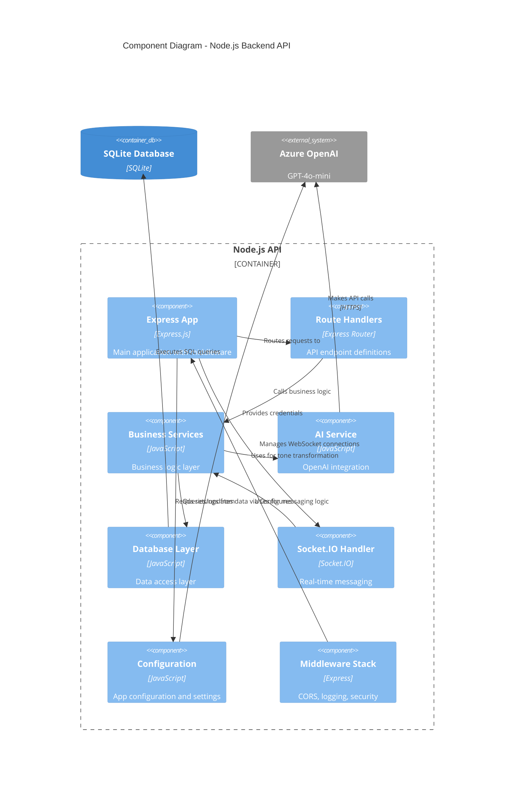

# C3 - Component Diagram (Backend)

## Overview

Shows the internal components of the Node.js API backend service and their relationships.

## Diagram

## Key Components

### Express App (`app.js`)

**Responsibility**: Main application factory

**Key Features**:
- Configures Express application
- Sets up middleware stack
- Mounts route handlers
- Initializes database
- Configures CORS for frontend communication

**Dependencies**:
- Morgan (HTTP request logging)
- Cookie parser
- CORS middleware
- Security headers middleware

### Route Handlers (`routes/`)

**Responsibility**: API endpoint definitions

**Routes**:
- **`routes/auth.js`**: Authentication endpoints (login, logout, register)
- **`routes/users.js`**: User management (profiles, online status)
- **`routes/chat.js`**: Chat and messaging endpoints
- **`routes/chatSocket.js`**: WebSocket chat handlers
- **`routes/health.js`**: Health check endpoint
- **`routes/hello.js`**: Test/demo endpoint

**Pattern**: Each router module handles a specific domain

### Business Services (`services/`)

**Responsibility**: Business logic implementation

**Services**:
- **User Service**: Registration, authentication, profile management
- **Message Service**: CRUD operations for messages
- **Tone Transformation Service**: Manages tone change requests
- **Chat Service**: Conversation management and message routing

**Pattern**: Service layer separates business logic from route handlers

### AI Service

**Responsibility**: Azure OpenAI integration

**Functions**:
- Initialize OpenAI client
- Transform message tone (funny, playful, serious)
- Handle API errors and retries
- Manage rate limiting
- Cache transformation results (optional)

**Integration**: Uses Azure OpenAI GPT-4o-mini deployed instance

### Database Layer (`db/`)

**Responsibility**: Data access abstraction

**Modules**:
- **`db/init.js`**: Database initialization and schema setup
- **`db/users.js`**: User data access methods
- **`db/posts.js`**: Message/post data access
- **`db/cache.js`**: Caching layer for performance

**Pattern**: Repository pattern for data access

**Database**: SQLite in-memory database

### Socket.IO Handler

**Responsibility**: Real-time WebSocket messaging

**Features**:
- WebSocket connection management
- Real-time message broadcasting
- User presence tracking (online/offline)
- Room-based messaging for conversations

**Events**:
- `message:send` - Send message
- `message:receive` - Receive message
- `user:online` - User comes online
- `user:offline` - User goes offline

### Configuration (`config/`)

**Responsibility**: Application settings

**Modules**:
- **`config/aiConfig.js`**: Azure OpenAI configuration
- **`config/socketConfig.js`**: Socket.IO configuration
- **`config/swagger.js`**: API documentation

**Pattern**: Centralized configuration management

### Middleware Stack

**Responsibility**: Request/response processing

**Middleware**:
- **CORS**: Cross-origin resource sharing for frontend
- **Morgan**: HTTP request logging
- **Security Headers**: X-Frame-Options, Content Security Policy
- **Request Tracking**: Request ID and correlation ID
- **Database Initialization**: Ensures DB is ready
- **Error Handling**: Global error handler

## Data Flow

### Message Send Flow

1. **Client** sends message via REST API
2. **Route Handler** (`routes/chat.js`) receives request
3. **Chat Service** validates and processes message
4. **AI Service** transforms tone (if requested)
5. **Database Layer** saves message
6. **Socket.IO Handler** broadcasts to recipients
7. **Response** sent back to client

### Authentication Flow

1. **Client** submits credentials
2. **Route Handler** (`routes/auth.js`) receives request
3. **User Service** validates username
4. **Database Layer** queries/creates user
5. **Session** created and returned
6. **User marked online** in database
7. **Socket connection** established

## Related Diagrams

- [C1 - System Context](./c1-system-context.md) - High-level system view
- [C2 - Container Diagram](./c2-container.md) - Container architecture
- [C4 - Code Diagram](./c4-code.md) - Code-level patterns
- [Main Architecture](./architecture.md) - Complete architecture overview
