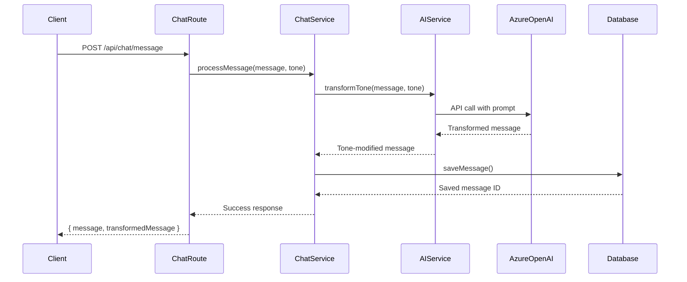
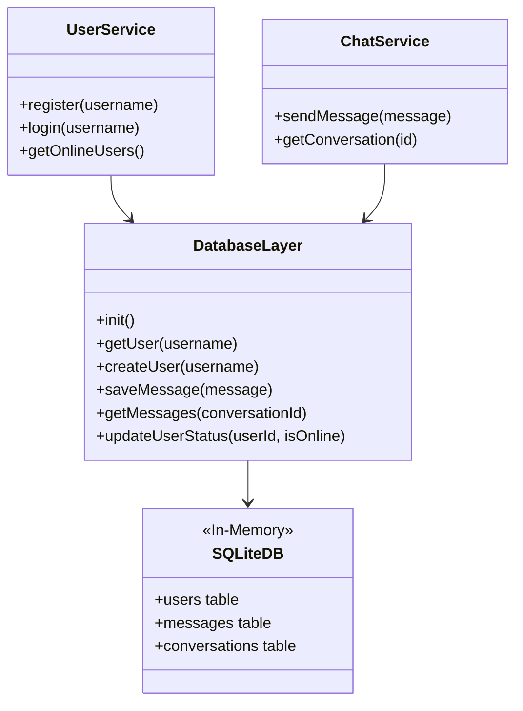

# C4 - Code Diagram (Backend)

## Overview

Detailed code-level patterns and key implementation details for the Node.js backend service.

## Key Code Patterns

### Express Middleware Chain

```mermaid
flowchart LR
    Request[HTTP Request] --> CORS[CORS Middleware]
    CORS --> Security[Security Headers]
    Security --> Tracking[Request Tracking]
    Tracking --> DBInit[DB Initialization]
    DBInit --> Logger[Morgan Logger]
    Logger --> JSON[JSON Parser]
    JSON --> Cookies[Cookie Parser]
    Cookies --> Routes[Route Handler]
    Routes --> Response[HTTP Response]
```



**Implementation**: `app.js`

**Pattern**: Middleware pipeline with cross-cutting concerns

**Key Middleware**:
1. **CORS**: Allows frontend origin (localhost:3000, 3001)
2. **Security Headers**: X-Frame-Options, CSP, HSTS
3. **Request Tracking**: Generates request-id and correlation-id
4. **DB Initialization**: Ensures database is ready
5. **Logging**: Morgan for HTTP request logs
6. **Parsers**: JSON body and cookie parsing

### AI Service Integration Pattern



**Implementation**: `services/aiService.js`, `routes/chat.js`

**Pattern**: Service layer orchestration with external API integration

**Key Steps**:
1. Route receives message with tone selection
2. Service validates and prepares message
3. AI service calls Azure OpenAI GPT-4o-mini
4. Transformed message returned
5. Both original and transformed messages saved
6. Response sent to client

### Database Access Pattern



**Implementation**: `db/` directory

**Pattern**: Repository pattern with service layer

**Characteristics**:
- SQLite in-memory database
- Synchronous operations for simplicity
- Schema initialization on startup
- No ORM (raw SQL queries)

### Socket.IO Event Handling

```javascript
// Connection Event Pattern
io.on('connection', (socket) => {
  // Authentication
  const userId = socket.handshake.query.userId;
  
  // Join user's personal room
  socket.join(`user:${userId}`);
  
  // Handle incoming events
  socket.on('message:send', async (data) => {
    // Process message
    const message = await chatService.sendMessage(data);
    
    // Broadcast to recipient
    io.to(`user:${data.recipientId}`).emit('message:receive', message);
  });
  
  // Handle disconnect
  socket.on('disconnect', () => {
    userService.setOffline(userId);
    io.emit('user:offline', { userId });
  });
});
```

**Implementation**: `routes/chatSocket.js`

**Pattern**: Event-driven real-time communication

**Key Events**:
- `connection`: User connects
- `message:send`: Send message
- `message:receive`: Receive message
- `user:online`: User status change
- `disconnect`: User disconnects

## Code Structure

### Application Entry Point

```javascript
// bin/www - Server creation
var app = require('../app');
var http = require('http');

var server = http.createServer(app);
server.listen(port);

// app.js - Application factory
var express = require('express');
var app = express();

// Middleware
app.use(cors(corsOptions));
app.use(securityHeaders);
app.use(requestTracking);

// Routes
app.use('/', indexRouter);
app.use('/api/auth', authRouter);
app.use('/api/users', usersRouter);
app.use('/api/chat', chatRouter);

module.exports = app;
```

**Pattern**: Separation of app configuration (app.js) from server creation (bin/www)

### Route Handler Pattern

```javascript
// routes/auth.js
var express = require('express');
var router = express.Router();
var authService = require('../services/authService');

router.post('/login', async function(req, res, next) {
  try {
    const { username } = req.body;
    
    // Validate input
    if (!username) {
      return res.status(400).json({ error: 'Username required' });
    }
    
    // Business logic in service
    const user = await authService.login(username);
    
    // Success response
    res.json({ success: true, user });
  } catch (error) {
    // Error handling
    next(error);
  }
});

module.exports = router;
```

**Pattern**: Thin route handlers, business logic in services

**Conventions**:
- CommonJS modules (var/require)
- Express router per domain
- Async/await for asynchronous operations
- Error handling via next()

### Configuration Management

```javascript
// config/aiConfig.js
module.exports = {
  azureOpenAI: {
    endpoint: process.env.AZURE_OPENAI_ENDPOINT,
    apiKey: process.env.AZURE_OPENAI_KEY,
    deploymentName: process.env.AZURE_OPENAI_DEPLOYMENT || 'gpt-4o-mini',
    apiVersion: '2024-02-15-preview'
  },
  tonePrompts: {
    funny: 'Rewrite this message in a funny, humorous tone...',
    playful: 'Rewrite this message in a playful, lighthearted tone...',
    serious: 'Rewrite this message in a serious, professional tone...'
  }
};
```

**Pattern**: Environment-based configuration with defaults

## Testing Patterns

### Route Testing

```javascript
// __tests__/routes/auth.test.js
describe('POST /api/auth/login', () => {
  it('should login user with valid username', async () => {
    const response = await request(app)
      .post('/api/auth/login')
      .send({ username: 'testuser' })
      .expect(200);
    
    expect(response.body.success).toBe(true);
    expect(response.body.user.username).toBe('testuser');
  });
});
```

**Pattern**: Supertest for integration testing

## Related Diagrams

- [C1 - System Context](./c1-system-context.md) - High-level system view
- [C2 - Container Diagram](./c2-container.md) - Container architecture
- [C3 - Component Diagram](./c3-component.md) - Component-level view
- [Main Architecture](./architecture.md) - Complete architecture overview
